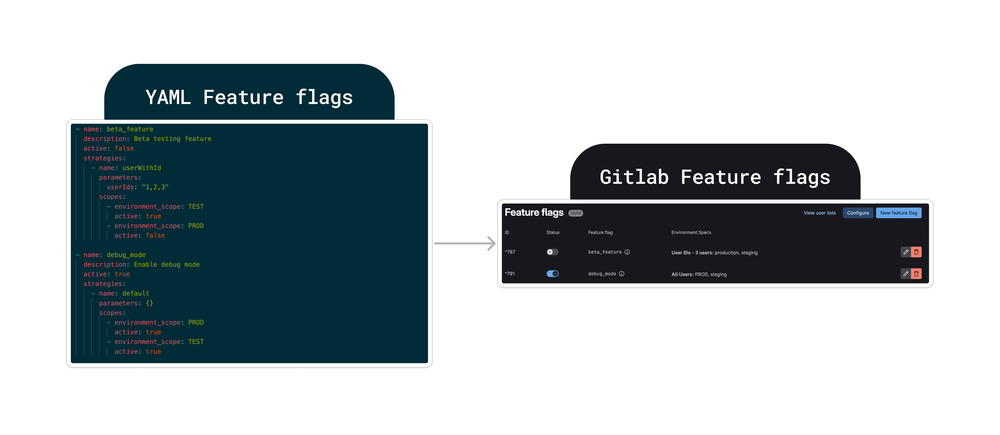

# gitlab-flagman - GitOps feature toggle for Gitlab

[](https://goreportcard.com/report/github.com/nkrus/gitlab-flagman)
[](https://github.com/nkrus/gitlab-flagman/actions)
[](https://opensource.org/licenses/MIT)

gitlab-flagman is a command line tool for managing feature flags in GitLab using a GitOps approach. It allows you to conveniently manage flags through configuration files and automatically sync changes with GitLab.

## Key Features

- Manage feature flags via the `yaml` file.
- Integrates with GitLab API for automatic updates to feature flags.
- Easy setup and usage.

## Requirements

- [Go](https://golang.org/) version 1.23 or later.
- Access to the GitLab API with a personal access token.

## Installation

1. Clone the repository:

   ```bash
   git clone <your-repository-URL>
   cd <project-directory>
   ```

2. Install dependencies:

   ```bash
   make deps
   ```

3. Build the binary:

   ```bash
   make build
   ```

## Usage

### Running the Application

You can run the application using the `feature_flags.yaml` configuration file:

```bash
make run
```

Alternatively, specify the parameters manually:

```bash
make run_p
```

```bash
go run cmd/main.go -flagsFile=feature_flags.yaml -gitLabBase=https://gitlab.com/api/v4 -gitLabToken=YOUR_TOKEN -gitLabProjectID=YOUR_PROJECT_ID
```

Ensure you set the required environment variables to interact with GitLab:

- `GITLAB_BASE`: Base URL of the GitLab API (e.g., `https://gitlab.com/api/v4`).
- `GITLAB_TOKEN`: Personal access token for the GitLab API.
- `GITLAB_PROJECT_ID`: ID of the GitLab project.

Example:

```bash
GITLAB_BASE=https://gitlab.com/api/v4 \
GITLAB_TOKEN=glpat-xxxxxxx \
GITLAB_PROJECT_ID=12345 \
make run_p
```

### Running Tests

To run the tests, use:

```bash
make test
```

### Linting

To check code quality, use:

```bash
make lint
```

### Cleaning

To remove build artifacts:

```bash
make clean
```

## Project Structure

- `cmd/`: Entry point of the application.
- `config/`: Configuration files.
- `feature_flags.yaml`: YAML file for feature flags.
- `internal/`: Internal modules and business logic.

## CI/CD

This project uses GitLab CI/CD for automating the following stages:
1. Code linting.
2. Running tests.
3. Building and releasing the application.

## License

This project is licensed under the [MIT License](LICENSE).

---

Let me know if you need further adjustments!